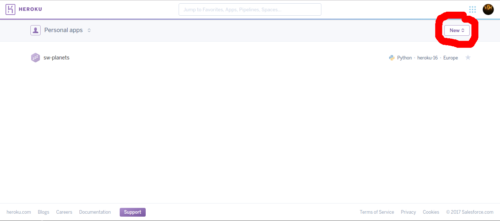
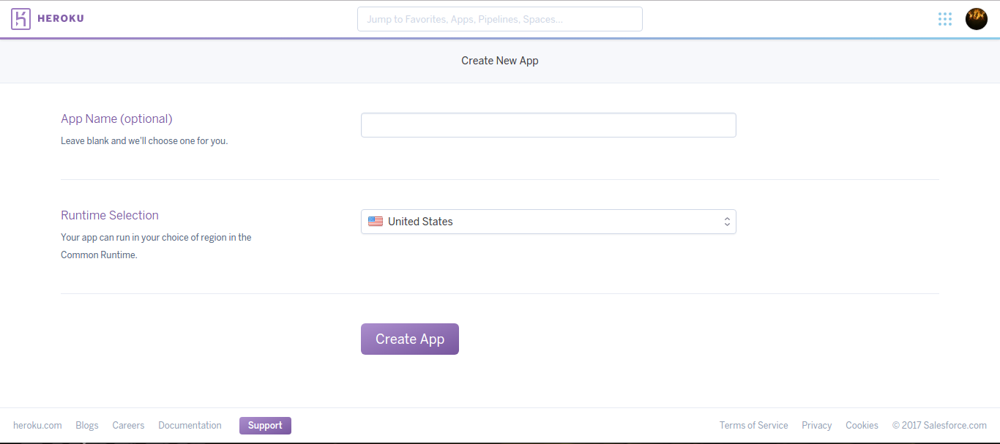
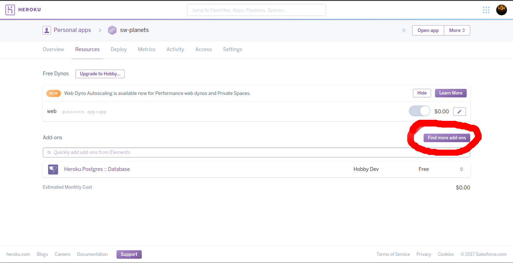

# Deploying a Flask app to Heroku

## Table of contents

- [Deploying a Flask app to Heroku](#deploying-a-flask-app-to-heroku)
  - [Table of contents](#table-of-contents)
  - [Foreword](#foreword)
  - [Create an account on Heroku](#create-an-account-on-heroku)
  - [Create an app on Heroku](#create-an-app-on-heroku)
  - [Install the Heroku CLI](#install-the-heroku-cli)
  - [Install the gunicorn package](#install-the-gunicorn-package)
    - [Why do you need gunicorn](#why-do-you-need-gunicorn)
    - [Installing gunicorn](#installing-gunicorn)
  - [Create config files](#create-config-files)
    - [Create the `runtime.txt`](#create-the-runtimetxt)
    - [Create the `requirements.txt`](#create-the-requirementstxt)
    - [Create the `Procfile`](#creat-the-procfile)
  - [Heroku Postgres](#heroku-postgres)
    - [Installing the Heroku Postgres add-on](#installing-the-heroku-postgres-add-on)
    - [Loading up your database schema](#loading-up-your-database-schema)
    - [Loading the configuration in your app and connecting it to the database](#loading-the-configuration-in-your-app-and-connecting-it-to-the-database)
  - [Get your application configuration](#get-your-application-configuration)
  - [Multiple or shared database](#multiple-or-shared-database)
  - [Deploy the app with git](#deploy-the-app-with-git)
  - [Pip pitfalls](#pip-pitfalls)

## Foreword

I created this guide for Codecool students in the first place but it is written in a way that almost anybody with a *Flask* app can follow along.

If you find any mistakes or errors in this guide feel free to open an *Issue* on [Github](https://github.com/marcellBan/heroku-flask) or even fork my repository, fix the issue and open a *Pull request*.

## Create an account on Heroku

Create an account on [Heroku](https://www.heroku.com/).

Activate your account with the link in the email they send you.

## Create an app on Heroku

Create a new app on the [dashboard](https://dashboard.heroku.com/apps).



On the next screen you can select a region and type in a name if you don't want *Heroku* to generate you one.



## Install the Heroku CLI

To install the *Heroku CLI* on your local machine (linux operating system) run the command below in a terminal window.

```shell
wget -qO- https://cli-assets.heroku.com/install-ubuntu.sh | sh
```

(To see all the install methods for other operating systems visit [Heroku's dev center](https://devcenter.heroku.com/articles/heroku-cli#ubuntu-debian-and-windows-bash))

## Install the gunicorn package

You need to install the `gunicorn` python package to run as your server on Heroku.

### Why do you need gunicorn

You might ask:

>Isn't Flask a webserver already? Why do we need gunicorn?

Yes you are totally right but *Flask* is not quite suited for production use and might have issues keeping up with requests if serving directly to the web so we are using `gunicorn` as a sort of middleware in the [WSGI](https://en.wikipedia.org/wiki/Web_Server_Gateway_Interface) server model.

### Installing gunicorn

The easiest way to install `gunicorn` is with `pip`. (The command below assumes you have only one python version installed. If you have multiple versions take a look at the [Pip pitfalls](#pip-pitfalls) section.)

```shell
pip install gunicorn
```

## Create config files

To make *Heroku* run your app properly you will need three configuration files (`runtime.txt`, `requirements.txt`, `Procfile`). All off them need to be in the root directory of your project (git repository).


### Create the `runtime.txt`

This file contains one line with the python version you want to use.

**You can find the latest supported versions on [Heroku's dev center](https://devcenter.heroku.com/articles/python-runtimes#supported-python-runtimes).**

So for example:

```plaintext
python-3.8.9
```

### Create the `requirements.txt`

This file will contain all the packages and their versions that your project depends on.

For the basic *Flask* app you will need at least these lines (you can get your installed versions from the command `pip freeze > requirements.txt`):

```plaintext
Flask==0.12.1
gunicorn==19.7.1
itsdangerous==0.24
Jinja2==2.9.6
MarkupSafe==1.0
Werkzeug==0.12.1
```

If you are using *Heroku Postgres* as a database and `psycopg2` to connect to the database and you want to make requests you should also add the following lines (versions are still from `pip freeze`):

```plaintext
psycopg2==2.7.1
requests==2.9.1
```

### Create the `Procfile`

**This file needs to be called exactly like this (without extension and with the uppercase '*P*').**

This file tells *Heroku* what kind of app you are trying to run and how to run it. The contents are pretty simple for our purposes:

```plaintext
web: gunicorn {app_filename}:{app_variable_name}
```

`{app_filename}` needs to be your apps main file without the *.py* extension this file needs to contain the initialization of the *Flask* object (eg.: `app = Flask(__name__)`) (it will be most likely called `app.py` or `main.py`).

`{app_variable_name}` needs to be the name of the variable containing the *Flask* object (eg.: `app` from the above example).

*Side note: using `gunicorn` this way means that you don't need the usual `if __name__ == '__main__':` block in your code as `gunicorn` will call `run()` on your app when needed.*

## Heroku Postgres

You can skip this part if your app does not use a *Heroku Postgres* database.

### Installing the Heroku Postgres add-on

Go to your dashboard on *Heroku* and select your app. Then navigate to the resources tab and press the *Find more add-ons* button.



Find the '*Heroku Postgres*' add-on and install it to your application.

Alternatively you can use command line to attach the add-on to your application.
If you want to execute *Heroku* command through terminal you have to log in:
```shell
heroku login
```
This command will ask for your credentials, use the email and password that you use for your *Heroku* account.

Now you can add *Heroku Postgres* with the following command:
```shell
heroku addons:create heroku-postgresql:hobby-dev --app {heroku_app_name}
```

### Loading up your database schema

Run the following commands in a terminal window:

```shell
heroku login
heroku pg:psql
```
The second command will open up a remote connection to your *Heroku* app database (the interface is basically identical to the standard `psql` program that you might run from the terminal with only a few minor features missing). Now you can run your SQL queries to set up your database. When you are done you can exit with the usual `\q`. Also you will need to run this command in your project directory or specify your app with the `--app {heroku_app_name}` option.

If you want to load sql file from the command line execute the following command:
```shell
heroku pg:psql --app {heroku_app_name} < {sql_file}
```

### Loading the configuration in your app and connecting it to the database

If you are using *python2.7* you can head over to [Heroku's dev center](https://devcenter.heroku.com/articles/heroku-postgresql#connecting-in-python) as the example code there will work just fine.

If you are using *python3* you will need to change some things around.

```python
import os
import psycopg2

connection_string = os.environ.get('DATABASE_URL')
connection = psycopg2.connect(connection_string)
```

With these changes your app should be ready for deployment.

## Get your application configuration

If you are interested in your heroku app's configuration you can check it with this command:

```shell
heroku config --app {heroku_app_name}
```

It lists the configuration and environment variables of your *Heroku* application.

## Multiple or shared database
If you want to add multiple database or share your database between multiple appliaction visit [Heroku's postgres site](https://devcenter.heroku.com/articles/heroku-postgresql#designating-a-primary-database)

## Deploy the app with git

Now you are ready to deploy your app.

If you haven't already managed your project with *git* you will need to initialize a new repository for it.

Navigate to your project's root directory in a terminal window an run the following commands:

```shell
git init
git add .
git commit -m "{your commit message}"
```

Now to add *Heroku* as a remote to your git repository run:

```shell
heroku git:remote -a {your app name}
```

You will need to be logged in to heroku to do this (you can log in with the `heroku login` command) and you need to specify the app name that you typed in at the beginning of this guide or the one that *Heroku* generated for you if you have not typed in anything (either way you can look it up on your dashboard).

The last step is to upload your app to *Heroku* and let it build.
You will have to specify which branch to upload (most likely it will be `master`).

```shell
git push heroku {branch_name}:master
```

Now *Heroku* will install all the packages listed in the `requirements.txt` file and then build and launch your app. If it fails please read the output it will more than likely tell you the exact problem.

For further troubleshooting you can also use the `heroku logs` command which will also show any error that occurred during the *normal* operation of your app.

Codecool students are welcome to contact me for further info/help.

## Pip pitfalls

Here are a few issues that you might encounter during the installation of a package with `pip`.

If you have multiple python versions installed on your machine and not using a virtual environment `pip` will install the package for *python2.7* and `pip3` will install for *python3*.

Also if you are not using a virtual environment you will probably need to run `pip` with elevated rights (`sudo` on Ubuntu).
